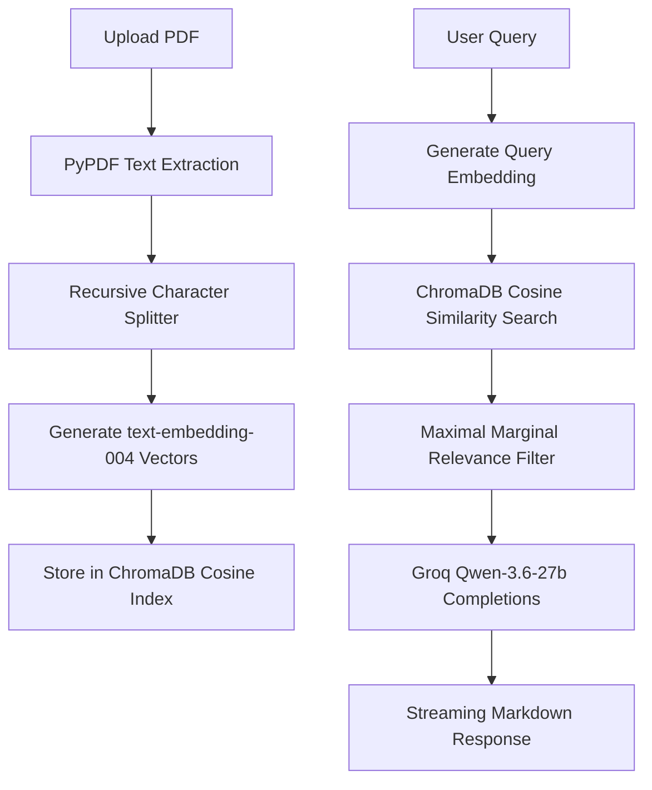

# 🌉 BridgeRAG Document AI Assistant

BridgeRAG is a premium, state-of-the-art Document-Based AI Assistant workspace. It enables users to upload PDF documents, build an interactive local semantic index, and have context-grounded conversations with inline, clickable page citations. 

The application is built around a **Glassmorphism** React workspace client and a resilient, high-performance **FastAPI + ChromaDB** RAG backend.

---

## 🛠️ Technology Stack

### Frontend (Client Workspace)
* **Core**: React 18 with strict TypeScript.
* **Build System**: Vite (lightning-fast HMR updates).
* **Styling**: Tailwind CSS v4 using modern CSS-first theme configurations.
* **Iconography**: Lucide React.
* **Layout Design**: Fluid responsive grid mapping supporting full three-column mode on desktop screens and overlay drawers on mobile/tablet viewports.

### Backend (AI Engine Services)
* **API Framework**: FastAPI (asynchronous endpoints, structured routing, and streaming responses).
* **Vector Database**: ChromaDB (local persistence, cosine-similarity index, and vector retrieval).
* **Reasoning Model**: Groq SDK querying **Qwen-3.6-27b** (reasoning-focused LLM).
* **Embedding Model**: Google GenAI SDK utilizing **text-embedding-004** (768-dimensional dense vectors).
* **PDF Engine**: PyPDF (asynchronous text layout extractor).

---

## 🧠 How Chunking & Retrieval Works (The RAG Flow)

BridgeRAG leverages advanced indexing and search techniques to ensure high relevance and low information redundancy:



### 1. Semantic Hierarchical Chunking (Recursive Splitting)
Instead of slice-chunking text by a rigid character count (which cuts words or mathematical anomalies in half), BridgeRAG uses a custom **Recursive Character Splitter**. 
* The splitter analyzes a hierarchy of natural separators: Paragraph boundaries (`\n\n`) $\rightarrow$ Line breaks (`\n`) $\rightarrow$ Word spaces (` `) $\rightarrow$ Characters (as a fallback).
* It recursively decomposes pages into semantic passages that fit within the `800` character limit, then backtracks to maintain a `150` character sliding overlap to preserve surrounding context.

### 2. Diversified Retrieval (Maximal Marginal Relevance)
To prevent the LLM from receiving redundant context blocks containing duplicate information, the search pipeline uses **Maximal Marginal Relevance (MMR)**:
1. The user's query is converted to a 768-dimensional embedding.
2. ChromaDB performs a similarity search to retrieve the top **10** candidate document chunks.
3. The MMR algorithm iterates through the candidates, balancing relevance against diversity:
   $$\text{MMR} = \arg\max_{D_i \in R \setminus S} \left[ \lambda \cdot \text{Sim}(D_i, Q) - (1 - \lambda) \cdot \max_{D_j \in S} \text{Sim}(D_i, D_j) \right]$$
4. It selects the top **4** chunks that contain the most unique and relevant insights, keeping the prompt dense and context-rich.

### 3. Dual Fallback Resilience
* **Offline Fallback**: If the Gemini/Groq API keys are missing or unauthenticated, the backend uses local deterministic SHA-256 hash embeddings and a local paragraph synthesizer. It merges the first sentence of each MMR chunk into a conversational answer, keeping the client interactive under any environment condition.
* **Reasoning Token Optimization**: Implements system prompt rules and max token constraints to ensure reasoning models do not exhaust the output token budget before finishing the final answer.

---

## 💻 Setup & Run Instructions

### Prerequisites
* **Python 3.10 or 3.11** installed on your system.
* **Node.js 18+** and **npm** installed.

---

### Step 1: Clone & Configure Backend

1. **Extract/Navigate** into the project workspace directory:
   ```bash
   cd "BridgeRAG Workspace"
   ```

2. **Configure Environment Variables**:
   Create a `.env` file in the `backend/` folder:
   ```env
   # backend/.env
   GOOGLE_API_KEY=your_gemini_api_key_here
   GROQ_API_KEY=your_groq_api_key_here
   PROJECT_NAME="BridgeRAG Document AI Assistant"
   ```
   *(Note: Groq keys start with `gsk_` and Gemini keys start with `AIzaSy`)*

3. **Initialize Python Virtual Environment**:
   * **Windows (PowerShell)**:
     ```powershell
     cd backend
     python -m venv .venv
     .venv\Scripts\Activate.ps1
     ```
   * **macOS / Linux**:
     ```bash
     cd backend
     python3 -m venv .venv
     source .venv/bin/activate
     ```

4. **Install Dependencies**:
   ```bash
   pip install -r requirements.txt
   ```

5. **Start Backend Web Server**:
   ```bash
   uvicorn main:app --reload
   ```
   The backend server will spin up at `http://127.0.0.1:8000`.

---

### Step 2: Install & Run Frontend

1. Open a new terminal window or tab.
2. **Navigate** into the `Frontend/` folder:
   ```bash
   cd Frontend
   ```
3. **Install Packages**:
   ```bash
   npm install
   ```
4. **Launch Vite Development Server**:
   ```bash
   npm run dev
   ```
   Open the browser link displayed in your console (usually `http://localhost:5173`) to open the workspace app.

---

## 📡 API Endpoints Overview

| Method | Endpoint | Description |
| :--- | :--- | :--- |
| `GET` | `/api/v1/documents` | Retrieve unique document profiles. |
| `POST` | `/api/v1/documents/upload` | Upload and semantically index a PDF. |
| `GET` | `/api/v1/documents/{document_id}/download` | Securely download the document under its friendly filename. |
| `GET` | `/api/v1/chunks/{chunk_id}` | Retrieve context text and metadata for a specific chunk. |
| `POST` | `/api/v1/chat/stream` | Stream LLM completions using MMR retrieval and custom prompt rules. |
